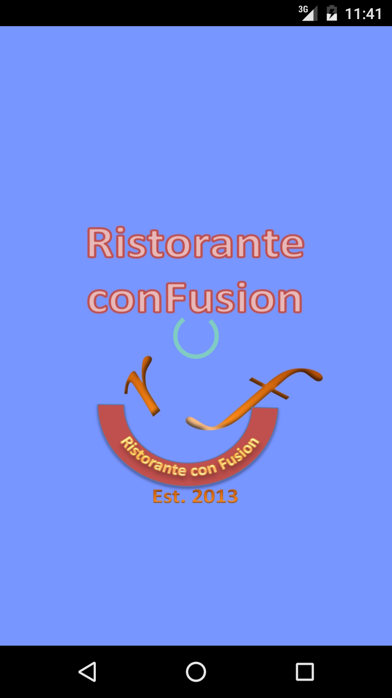
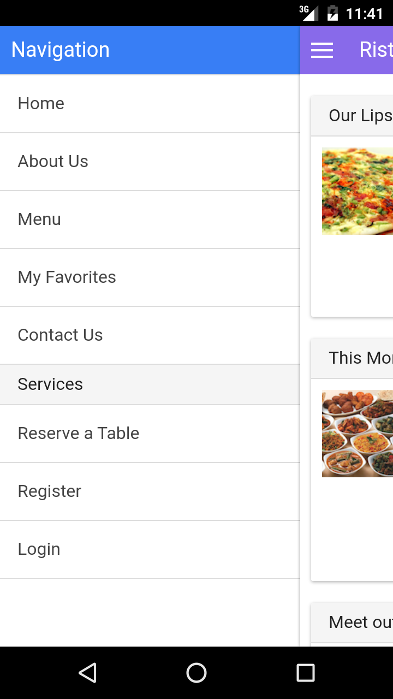
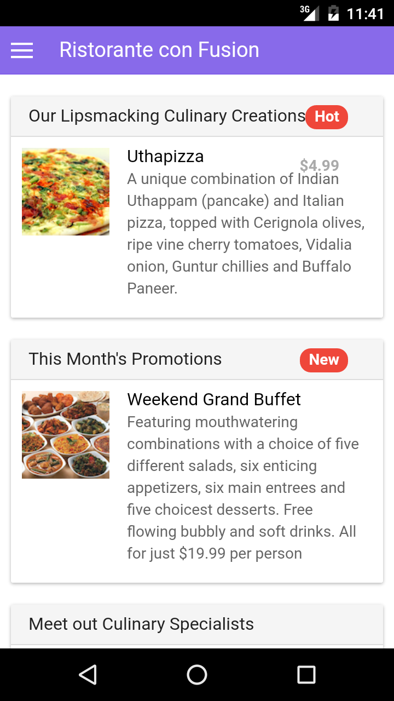
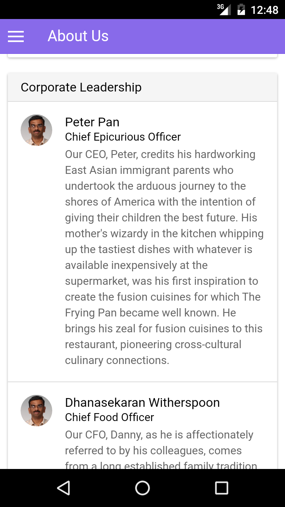
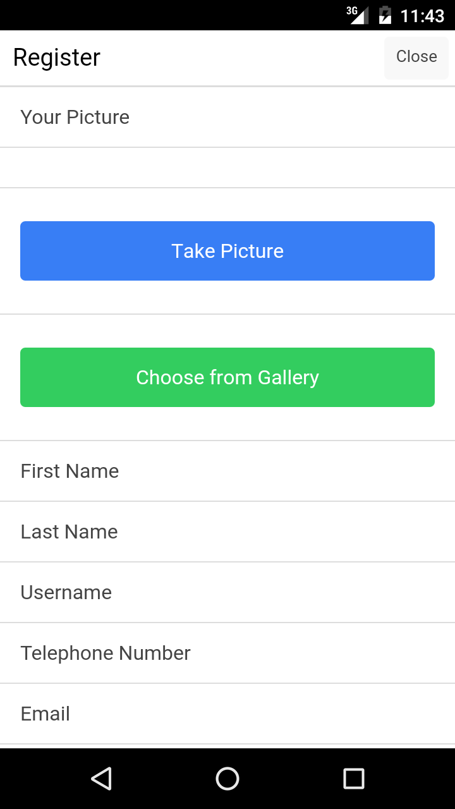
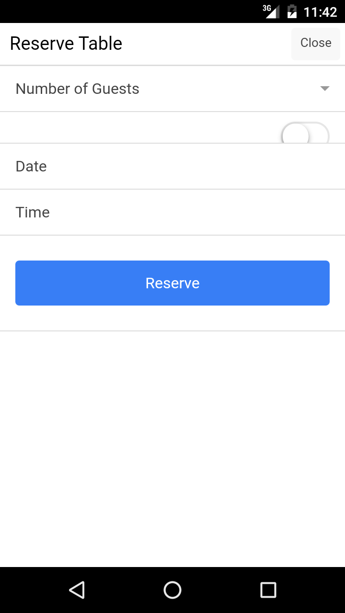
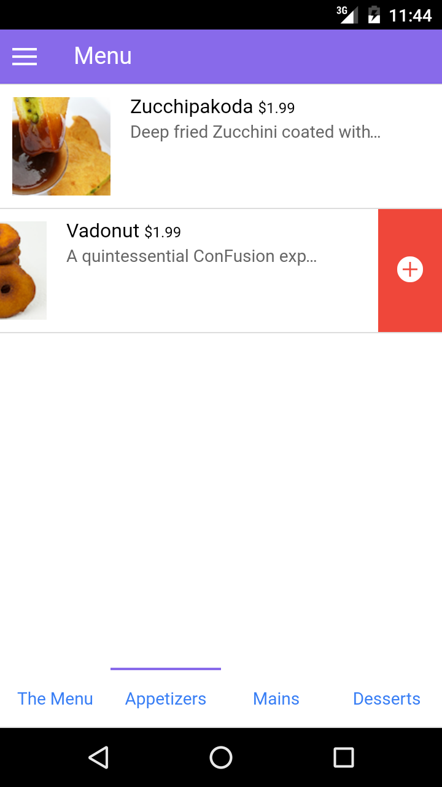
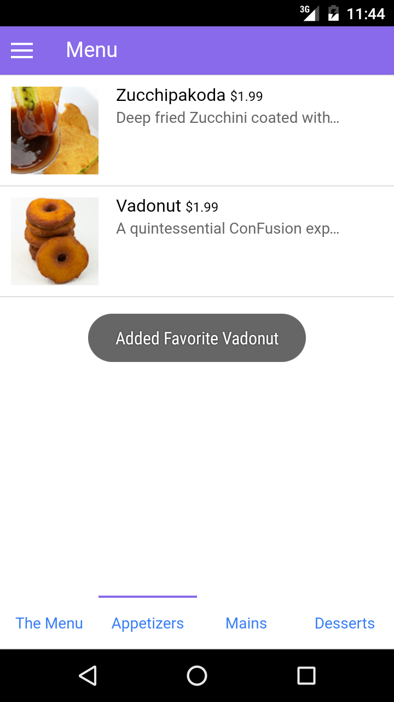
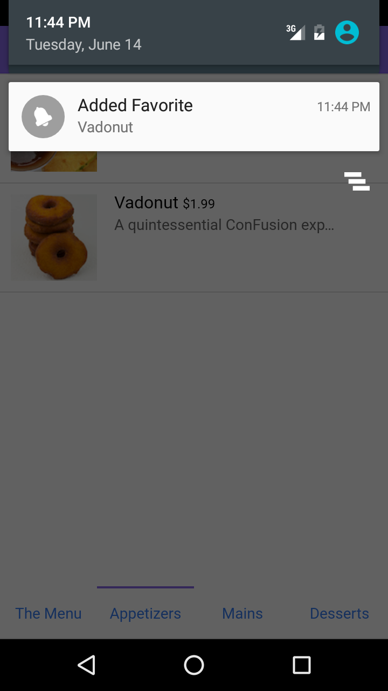
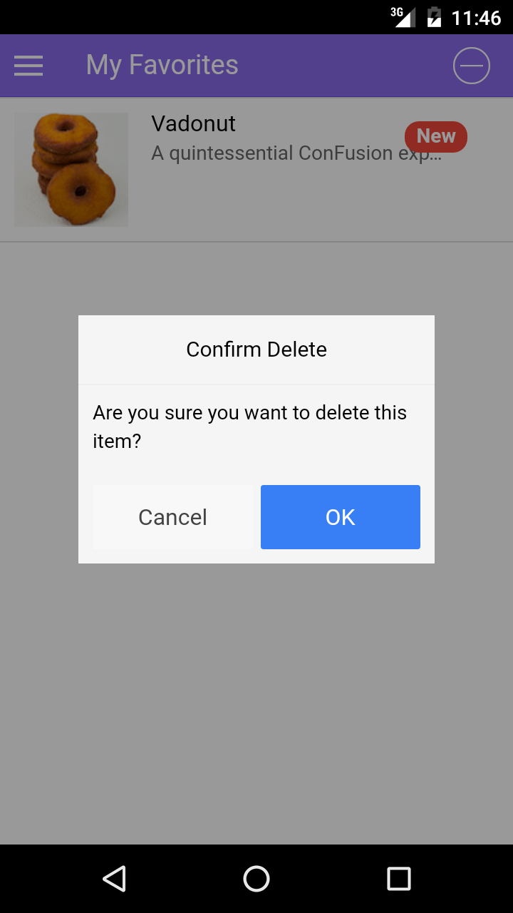

# Ionics App for Ristorante con Fusion

## Introduction
I did this project as part of my participation in Coursera's Full Stack Web Development specialization.  The purpose of this project was to create a hybrid app for a fictitious restaurant, Ristorante con Fusion.  The platform of choice was Ionics on Cordova. The generated app was tested on x86 Android emulator provided by Google.  

## Installation and usage

To try the app on a an android device, you may copy the `/platforms/android/build/outputs/apk/android-release-unsigned.apk` to your android device and install it by tapping on the apk file icon; you will need to turn on the "install from unknown sources" option prior to this.  To try the app on emulators or on ios, you will need to install the respective software development kit.  

To build the app you will need to install cordova, ionics and either android or ios sdk. You may then install the package dependencies using `npm install` and `bower install`.  You will also need to install json-server using `sudo npm install -g json-server`.  You must then start json server on your computer by running `json-server --watch db.json` in the project root directory. You may then use sdk tools to run the app in your device/emulator.  

## Features and Screenshots

The app uses a sidebar for internal navigation.

Throughout the app resources are loaded dynamically via AJAX requests to a local server using the ngResource modul of angular. This includes the text and the images in the home page, the list of dishes in the menu page and the list of restaurant founders in the about page.

Ionic modals were used extensively in design of the login and register views as well as reservation capability of the app. Cordova's wrappers were used in the project to access native device functions such as taking a picture with camera or choosing a picture from gallery.

HTML5 local storage was used to persist data in JSON format between sessions of the app.  Cordova wrappers were used to provide pop-up messages and notification messages in reacion to user's choices.  

## Conclusion

Hybrid platforms are awesome.  They eliminate the hardships of developing apps for multiple operating systems.  They also bridge the gap between creating a webpage and apps.  Considering that many of today's apps are also available as webpages, this is pretty neat.  Ionic and Cordova are the most popular way of creating hybrid apps at the moment and after completing this project, I believe that I have a good understanding of the techniques of developing hybrid apps using ionics.
